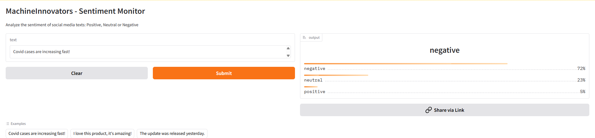

# Sentiment Drift Monitoring

Brand reputation monitoring on social media: a sentiment classifier served as a
live app, plus a drift detector that watches whether incoming sentiment shifts
away from its baseline.

**[Live demo]([Live demo](https://huggingface.co/spaces/Schiro/Sentiment-Drift-Monitoring))**



## What it does

A deployed classifier tells you the sentiment of one text. That is not enough to
monitor a brand: what matters is whether the share of negative mentions is
changing. This repo does both — serves the model, and tracks the distribution
over time against a reference.

## Drift detection

The stream is split into consecutive windows of 500 texts. The first four
windows define the baseline — what normal looks like — and every window after
that is compared against it. The metric is the negative share, because that is
the one that triggers an action.

```
window      negative   neutral  positive     shift
--------------------------------------------------
4             40.40%    39.80%    19.80%    +3.80%
5             37.20%    43.00%    19.80%    +0.60%
6             34.60%    46.20%    19.20%    -2.00%
7             39.60%    39.20%    21.20%    +3.00%
8             34.80%    43.80%    21.40%    -1.80%
```

Natural variation stays within ±4 points, which is how the alert threshold was
set: **10 points** is roughly two and a half times the observed noise — far
enough not to fire on randomness, close enough to catch a real shift.

When a window crosses the threshold the script exits non-zero. A scheduled
GitHub Actions workflow runs it daily, so a drift makes the job fail and sends a
notification — no alerting code to write.

Two tests cover the detector itself: one window matching the baseline must stay
quiet, one with a 15-point jump in negatives must fire. Without the second test,
a detector that never alerts would look exactly like a healthy system.

## Model performance

`cardiffnlp/twitter-roberta-base-sentiment-latest`, used off the shelf, scored on
the full TweetEval test set (12,284 tweets):

| | precision | recall | F1 | support |
|---|---|---|---|---|
| negative | 0.689 | 0.807 | 0.743 | 3,972 |
| neutral | 0.757 | 0.658 | 0.704 | 5,937 |
| positive | 0.710 | 0.741 | 0.725 | 2,375 |
| **accuracy** | | | **0.722** | 12,284 |
| macro avg | 0.719 | 0.735 | 0.724 | |

Macro F1 rather than weighted, because the test set is unbalanced and weighted
averaging hides the smaller classes.

**Where the errors are.** 96% of all mistakes involve the neutral class. Direct
negative-to-positive confusion is 128 tweets out of 12,284, about 1%.

That matters more than the headline number for this use case. The model catches
81% of negative tweets, and when it misses one it calls it neutral (711 cases),
almost never positive (57). A crisis does not get read as praise. The most common
error runs the other way — 1,372 neutral tweets flagged as negative — so the
model leans toward over-reporting negativity, which is the safer side to fail on.

The absolute negative share it reports is therefore inflated. The monitor
compares every window against a baseline produced by the same model, so the bias
sits on both sides of the comparison and cancels: what is measured is the change,
not the level.

## Pipeline

Every push runs CI: flake8, pytest, and a gate that blocks the deploy if accuracy
or macro F1 on 2,000 held-out tweets falls below 0.65. CD runs only if CI passed,
and uploads the app to HuggingFace Spaces. A third workflow runs the drift
monitoring on a daily schedule, independently of both.

All three environments — the Space, the container and the CI runner — pin the
same Python version, so an incompatibility shows up in CI rather than after a
deploy.

## Running it

```bash
pip install -r requirements-dev.txt

cd src
python evaluation.py    # full test set report
python monitoring.py    # one window of drift monitoring
```

MLflow logs every window, so the distribution can be read as a time series:

```bash
mlflow ui --backend-store-uri sqlite:///mlflow.db
```

The app also runs as a container:

```bash
docker build -t sentiment-app .
docker run -p 7860:7860 sentiment-app
```

## Structure

```
src/
  model_setup.py   model, preprocessing, batched inference
  evaluation.py    scoring on the test set
  monitoring.py    source, baseline, drift detection
  app.py           Gradio interface
tests/             preprocessing, prediction, drift logic
deploy.py          upload to HuggingFace Spaces
```

## Limits

- **The stream is simulated.** Windows are slices of the TweetEval test set,
  walked by calendar date so a scheduled run sees new data each day. Swapping in
  a real source means replacing `get_window` and nothing else — but the X API is
  paid, so it stays out of scope here
- The model is trained on tweets. On reviews or longer-form text it will still
  work, worse, by an amount that would have to be measured on labelled data from
  that source
- A baseline is not portable across platforms: complaint-heavy sources have a
  different normal
- The baseline is recomputed on every scheduled run, since the runner starts
  clean. It is deterministic, so the value is stable, but it costs a couple of
  minutes per run
